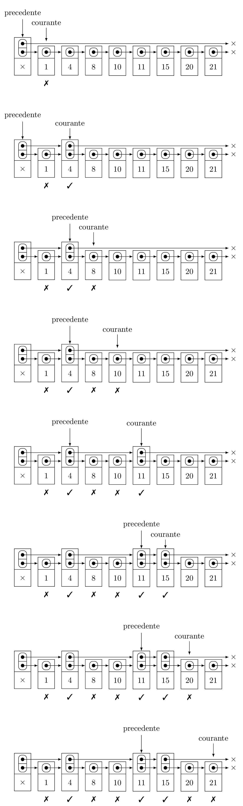
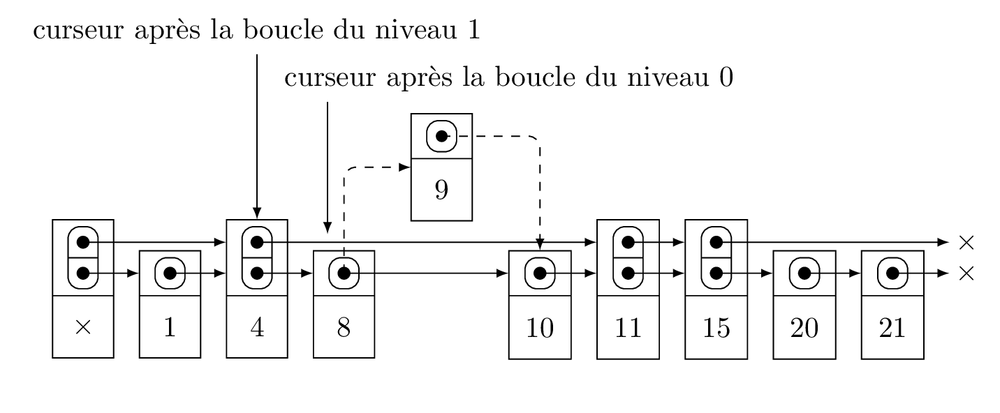

[](https://forge.univ-lyon1.fr/lifap6/tp-skiplist-etu/commits/master)

Ce TP a pour but de vous faire programmer une skip liste. Les skip listes sont
une évolution des listes chaînées pour permettre d'implémenter le type abstrait
*Collection triée*.  Une collection triée est uns structure de données
permettant de réaliser les opérations suivantes :

  * insérer un élément dans la collection ;
  * déterminer si un élément est présent dans la collection ;
  * lister les éléments de la collection dans l'ordre.

Pour pouvoir réaliser ces opérations, il est nécessaire que les éléments insérés
dans la skip liste puissent être ordonnés. Nous utiliserons des entiers dans le
cadre de ce TP.

[[_TOC_]]

# Code de base

Vous trouverez dans le dossier `src` un code de base non fonctionnel pour les
skip-listes :

  * une classe `SkipCellule` pour les maillons de la skip liste ;
  * une classe `SkipListe` pour la skip liste.

La structure que vous trouverez ressemble pour le moment fortement à celle d'une
liste chaînées. La différence majeure est dans les cellules : une cellule de
skip liste peut avoir plusieurs cellules suivantes qui sont stockées dans un
tableau dynamique via la classe `vector` de la librairie standard. En se
restreignant à la première case de ce tableau dynamique, accessible via
`suivante[0]`, une skip liste a exactement la même structure qu'une liste
chaînée. Nous verrons plus tard comment ajouter plus de cellules suivantes.

Une autre particularité des skip listes est qu'elles sont munies d'une cellule
sentinelle. Ainsi, dans le code fourni, vous pouvez voir qu'à la création d'une
skip liste, une première cellule est créée avec une valeur qui n'est pas sensée
être utilisée ou lue. À ce stade, cette cellule sera déjà utile car elle assure
que toute cellule de la skip liste a une cellule précédente, ce qui évite de
gérer des cas particuliers lorsqu'on travaille en tête de liste. Si cette
cellule vous perturbe, dites vous que la tête de la liste est la suivante de la
sentinelle.

# Liste triée

Nous allons pour l'instant assurer le côté *trié* de la collection en faisant en
sorte que les valeurs stockées dans la skip liste soient toujours triées.

## Insertion

### Principe

Dans une skip liste, on ne peut pas choisir d'ajouter en tête ou en queue de
liste. Les valeurs sont triées dans la liste. Ainsi l'endroit où vient s'insérer
une nouvelle valeur dépend de cette valeur par rapport aux autres déjà présentes
dans la liste. On n'a donc pas le choix. Pour l'instant, la skip liste est munie
d'une fonction insertion qui insère en tête, ce qui n'est pas correct. La bonne
façon d'insérer est d'avancer dans la liste jusqu'à trouver une cellule dont la
valeur est plus petite que la valeur insérée, et dont la suivante a une valeur
plus grande. La nouvelle cellule doit donc être insérée entre ces deux cellules.
L'algorithme pour réaliser cette insertion est donc le suivant :

```
  - positionner un curseur sur la cellule sentinelle
  - Tant que la cellule suivant le curseur existe et a une valeur plus petite
  | - avancer le curseur sur sa cellule suivante
  - insérer la nouvelle cellule entre le curseur et sa suivante
```


Sur l'image ci-dessus, pour insérer la cellule 9, il faut placer un curseur sur
la cellule sentinelle (avec la valeur X), puis avancer ce curseur jusqu'à la
cellule 8. La cellule 8 est la bonne cellule car sa suivante a la valeur 10 qui
est plus grande que 9. Une fois le curseur sur 8, la nouvelle cellule 9 peut
prendre pour suivante 10, et 8 prend pour suivante 9.

### Objectf

Modifiez la fonction d'insertion pour vous assurer que les valeurs sont insérées
à la bonne position dans la skip liste.

## Recherche

### Principe

La recherche fonctionne sur le même principe que l'insertion : on initialise un
curseur sur la sentinelle, et on avance tant que la suivante est plus petite ou
égale à la valeur cherchée. À la sortie, il y a trois possibilités :

  * le curseur est la sentinelle : pas trouvé ;
  * le curseur est sur une cellule de la bonne valeur : trouvé ;
  * sinon : pas trouvé.

### Objectif

Modifiez la fonction de recherche pour qu'elle fonctionne. Modifiez ensuite le
main dans le fichier `test_skipliste` pour vérifier que votre recherche
fonctionne.

# Ajouter un etage pour accélérer

Le principe des skip listes est d'accélérer la recherche du point d'insertion ou
d'un élément. Pour ce faire, on ajoute des niveaux permettant d'avancer plus
vite sur la liste. Attention cependant, les niveaux n'ont pas tous les éléments,
donc il faudra nécessairement redescendre au niveau 0 à la fin pour s'assurer que
l'insertion se fait au bon endroit, ou que la recherche est terminée.

## Création d'un niveau

Pour créer un niveau, il faut parcourir la liste et déterminer pour chaque
cellule si elle est sélectionnée ou non pour le nouveau niveau. Les cellules
sélectionnées gagnent une nouvelle suivante, et sont chaînées entre elles. Pour
sélectionner les cellules, nous utiliserons la fonction `pile_ou_face` fournie.

### Principe

Pour ajouter un niveau, il faut commencer par ajouter une suivante à la cellule
sentinelle. Tant qu'il n'y a pas de cellules sélectionnées, le niveau est vide,
et donc la suivante de la sentinelle est `nullptr`. On va ensuite faire avancer
deux curseurs. Le premier parcourera toutes les cellules de la liste pour
déterminer si elles sont sélectionnées. Ce curseur est initialisé sur la cellule
suivante de la sentinelle au niveau 0. Il avancera ensuite sur le niveau 0 de
suivante en suivante. Le second servira à se souvenir de la dernière cellule
sélectionnée pour le nouveau niveau, afin de pouvoir ajouter les nouvelles
cellules sélectionnées à la suite. Il est donc initialisé sur la cellule
sentinelle, et avancera à chaque cellule sélectionnée. L'algorithme est donc le
suivant :

```
- ajouter une suivante nullptr à la cellule sentinelle
- initialiser la cellule courante sur la suivante de la sentinelle au niveau 0
- initialiser la precedente sur la celluls sentinelle
- Tant que la courante n'a pas atteint la fin de la liste
| - tirer a pile ou face si la courante est sélectionnée
| - Si elle est sélectionnée
| | - ajouter une suivante nullptr à la courante
| | - la suivante au niveau 1 de la précédente devient la courante
| | - la précédente devient la courante
| - la courante avance sur sa suivante
```

Le fonctionnement de cet algorithme est illustré ci-dessous. En dessous de
chaque cellule, il est indiqué si elle est sélectionnée ou non. Lorsque la
cellule n'est pas sélectionnée, l'image affiche l'étant avant de faire avancer
la courante sur sa suivante. Si la cellule est sélectionnée, l'image affiche
l'état avant de faire avancer la précédente sur la courante.




### Objectif

Ajoutez une méthode `void ajouter_niveau()` à la classe `SkipListe` pour ajouter
un niveau, et implémentez l'algorithme ci-dessus pour ajouter un niveau. Pour
ajouter une nouvelle suivante à une cellule, il suffit d'ajouter la méthode
`push_back` de la classe `vector`, qui permet d'ajouter un élément à la fin du
tableau dynamique. 

Modifiez ensuite la fonction d'affichage pour afficher le niveau ajouté en plus
du niveau initial. Il suffit pour cela de reprendre le code actuel et de le
dupliquer en utilisant `suivante[1]` au lieu de `suivante[0]`.

## Accélération de la recherche et de l'insertion

Il est désormais possible d'acclérer la recherche et l'insertion en utilisant ce
niveau supplémentaire. 

### Principe

Pour trouver plus rapidement un élément, ou la position d'insertion, le principe
consiste à avancer d'abord sur le niveau 1 autant que possible, puis finir sur
le niveau 0. Le niveau 1 comportant en moyenne deux fois moins d'éléments, on
avance dessus deux fois plus vite. Pour l'insertion, l'algorithme devient donc

```
  - positionner un curseur sur la cellule sentinelle
  - Si le niveau 1 existe
  | - Tant que la cellule suivant le curseur au niveau 1 existe et a une valeur plus petite
  | | - avancer le curseur sur sa cellule suivante au niveau 1
  - Tant que la cellule suivant le curseur au niveau 0 existe et a une valeur plus petite
  | - avancer le curseur sur sa cellule suivante au niveau 0
  - insérer la nouvelle cellule entre le curseur et sa suivante au niveau 0
```

notez ici que le curseur n'est **pas** réinitialisé entre les deux boucles. La
boucle sur le niveau 0 n'aura donc plus beaucoup de chemin à faire. Notez
également que pour le moment, les nouvelles cellules ne sont insérées qu'au
niveau 0, on ne les ajoute pas au niveau 1.



### Objectif

Modifiez les fonctions insertion et recherche pour prendre en compte le niveau
que vous avez ajouté s'il existe. Pour savoir si le niveau 1 est créé, vous
pouvez utiliser la méthode `size` de la classe `vector` sur le tableau de
suivantes de la sentinelle : si le tableau est de taille 2, il y a un niveau 1.
Modifiez ensuite la fonction de test pour vous assurer que des cellules de
niveau 0 et des cellules de niveau 1 sont bien trouvées.

## Insertion au niveau 1

Il serait injuste que les nouvelles cellules soient exclues du niveau 1. Nous
allons donc également leur permettre de faire un pile ou face pour leur
permettre de s'intégrer au niveau 1.

### Principe

Pour pouvoir ajouter une cellule à un niveau, il est nécessaire de connaître la
cellule précédente au niveau en question. Pour pouvoir réaliser l'insertion au
niveau 1, il faut donc se souvenir de la cellule précédente au niveau 1. Il
s'agit de celle obtenue à l'issue de la boucle sur le niveau 1, avant de
réaliser la boucle sur le niveau 0. L'insertion devient alors :

```
  - creer un curseur 1 positionné sur la cellule sentinelle
  - Si le nivea 1 existe
  | - Tant que la cellule suivant le curseur au niveau 1 existe et a une valeur plus petite
  | | - avancer le curseur sur sa cellule suivante au niveau 1
  - creer un curseur 0 positionné sur la même cellule que le curseur 1
  - Tant que la cellule suivant le curseur au niveau 0 existe et a une valeur plus petite
  | - avancer le curseur sur sa cellule suivante au niveau 0
  - insérer la nouvelle cellule entre le curseur 0 et sa suivante au niveau 0
  - Si le niveau 2 existe et la nouvelle cellule est sélectionnée pour le niveau 1
  | - insérer la nouvelle cellule entre le curseur 1 et sa suivante au niveau 1
```

### Objectif

Modifiez la fonction d'insertion pour permettre aux nouvelles cellules d'arriver
au niveau 1. Modifiez également la fonction de test pour vous assurer qu'une
fois le niveau 1 créé, certaines cellules insérées apparaissent au niveau 1,
mais pas toutes (une sur deux en moyenne).

# Niveaux multiples
