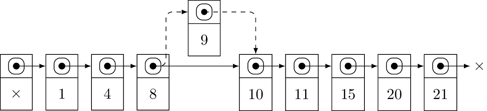

# Lifap6 — Skip Listes

[](https://forge.univ-lyon1.fr/lifap6/tp-skiplist-etu/commits/master)

Ce TP a pour but de vous faire programmer une skip liste. Les skip listes sont
une évolution des listes chaînées pour permettre d'implémenter le type abstrait
*Collection triée*.  Une collection triée est uns structure de données
permettant de réaliser les opérations suivantes :

  * insérer un élément dans la collection ;
  * déterminer si un élément est présent dans la collection ;
  * lister les éléments de la collection dans l'ordre.

Pour pouvoir réaliser ces opérations, il est nécessaire que les éléments insérés
dans la skip liste puissent être ordonnés. Nous utiliserons des entiers dans le
cadre de ce TP.

## Code de base

Vous trouverez dans le dossier `src` un code de base non fonctionnel pour les
skip-listes :

  * une classe `SkipCellule` pour les maillons de la skip liste ;
  * une classe `SkipListe` pour la skip liste.

La structure que vous trouverez ressemble pour le moment fortement à celle d'une
liste chaînées. La différence majeure est dans les cellules : une cellule de
skip liste peut avoir plusieurs cellules suivantes qui sont stockées dans un
tableau dynamique via la classe `vector` de la librairie standard. En se
restreignant à la première case de ce tableau dynamique, accessible via
`suivante[0]`, une skip liste a exactement la même structure qu'une liste
chaînée. Nous verrons plus tard comment ajouter plus de cellules suivantes.

Une autre particularité des skip listes est qu'elles sont munies d'une cellule
sentinelle. Ainsi, dans le code fourni, vous pouvez voir qu'à la création d'une
skip liste, une première cellule est créée avec une valeur qui n'est pas sensée
être utilisée ou lue. À ce stade, cette cellule sera déjà utile car elle assure
que toute cellule de la skip liste a une cellule précédente, ce qui évite de
gérer des cas particuliers lorsqu'on travaille en tête de liste. Si cette
cellule vous perturbe, dites vous que la tête de la liste est la suivante de la
sentinelle.

## Liste triée

Nous allons pour l'instant assurer le côté *trié* de la collection en faisant en
sorte que les valeurs stockées dans la skip liste soient toujours triées.

### Insertion

#### Principe

Dans une skip liste, on ne peut pas choisir d'ajouter en tête ou en queue de
liste. Les valeurs sont triées dans la liste. Ainsi l'endroit où vient s'insérer
une nouvelle valeur dépend de cette valeur par rapport aux autres déjà présentes
dans la liste. On n'a donc pas le choix. Pour l'instant, la skip liste est munie
d'une fonction insertion qui insère en tête, ce qui n'est pas correct. La bonne
façon d'insérer est d'avancer dans la liste jusqu'à trouver une cellule dont la
valeur est plus petite que la valeur insérée, et donc la suivante a une valeur
plus grande. La nouvelle cellule doit donc être insérée entre ces deux cellules.



Sur l'image ci-dessus, pour insérer la cellule 9, il faut placer un curseur sur
la cellule sentinelle (avec la valeur X), puis avancer ce curseur jusqu'à la
cellule 8. La cellule 8 est la bonne cellule car sa suivante a la valeur 10 qui
est plus grande que 9. Une fois le curseur sur 8, la nouvelle cellule 9 peut
prendre pour suivante 10, et 8 prend pour suivante 9.

#### Objectf

Modifiez la fonction d'insertion pour vous assurer que les valeurs sont insérées
à la bonne position dans la skip liste. L'algorithme pour réaliser cette
insertion est le suivant :

```
  - positionner un curseur sur la cellule sentinelle
  - tant que la cellule suivant le curseur existe et a une valeur plus petite
  | - avancer le curseur sur sa cellule suivante
  - insérer la nouvelle cellule entre le curseur et sa suivante
```

### Recherche

#### Principe

La recherche fonctionne sur le même principe que l'insertion : on initialise un
curseur sur la sentinelle, et on avance tant que la suivante est plus petite ou
égale à la valeur cherchée. À la sortie, il y a trois possibilités :

  * le curseur est la sentinelle : pas trouvé ;
  * le curseur est sur une cellule de la bonne valeur : trouvé ;
  * sinon : pas trouvé.

#### Objectif

Modifiez la fonction de recherche pour qu'elle fonctionne. Modifiez ensuite le
main dans le fichier `test_skipliste` pour vérifier que votre recherche
fonctionne.

## Ajouter un etage
